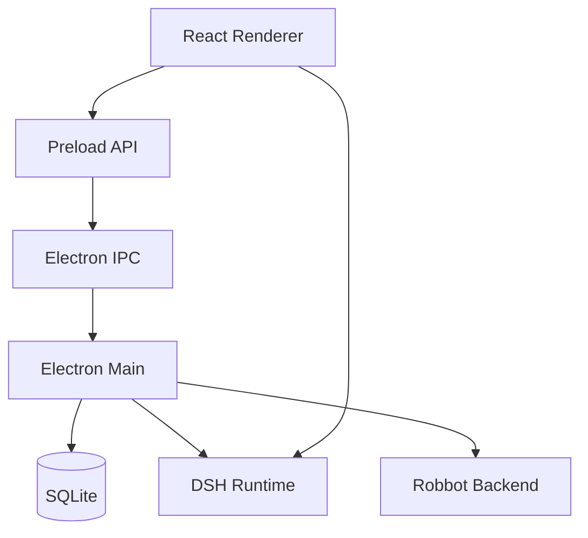

# robbot

> 基于 DeepSeek Harness 的桌面 Agent 客户端。

[](https://github.com/huiruo/robbot/actions/workflows/ci.yml)

Robbot 是一个 **Electron + React + SQLite + DeepSeek Harness** 桌面应用。应用侧负责账号、配置、桌面壳和发布流程；Agent 会话、工具调用、审批、上下文等能力由 DSH runtime 提供。

## 下载安装

当前正式安装包支持 Windows x64 和 macOS arm64。无需额外环境，下载安装后一键使用。

| 平台 | 下载 | 安装方式 |
| --- | --- | --- |
| Windows x64 | [下载 exe](https://github.com/huiruo/robbot/releases/download/v1.0.0/Robbot-windows-x64.zip) | 解压后运行 Robbot |
| macOS arm64 | [下载 ZIP](https://github.com/huiruo/robbot/releases/download/v1.0.0/Robbot-darwin-arm64-1.0.0.zip) | 解压后安装 Robbot


## 架构



核心边界：

- Robbot：认证、账号配置、桌面窗口、IPC、打包发布
- DSH：会话、工具、审批、上下文、Web UI
- Backend：账号服务、桌面版本服务

## 功能
- DSH Web UI 集成
- 本地数据持久化
- Windows / macOS 打包
- 多账号,桌面端版本管理

## 快速开始

前置要求：

- Node.js >= 22
- pnpm 10
- Git submodule

```bash
git submodule update --init --recursive
pnpm install
pnpm dsh:setup
pnpm dev
```

## 常用命令

| 命令 | 说明 |
|---|---|
| `pnpm dev` | 启动桌面应用 |
| `pnpm build` | 构建 workspace |
| `pnpm test:dsh` | 运行 DSH 契约测试 |
| `pnpm dsh:setup` | 安装并构建 DSH runtime |
| `pnpm dsh:build` | 构建已有 DSH runtime |
| `pnpm dsh:update` | 更新 DSH submodule |
| `pnpm dsh:info` | 查看 DSH runtime 信息 |

## Desktop

入口目录：

```bash
cd apps/desktop
```

| 命令 | 说明 |
|---|---|
| `npm run package` | 生成展开后的 Electron app |
| `npm run make:mac` | 生成 macOS arm64 发布包 |
| `npm run make:win` | 生成 Windows Squirrel 安装包 |
| `npm run make:win:nsis` | 生成 Windows NSIS 安装包 |

## 项目结构

```text
robbot/
├── apps/
│   └── desktop/
│       ├── electron/       # Electron main / preload / storage / IPC
│       └── renderer/       # React renderer
├── packages/
│   ├── core/
│   ├── dsh-adapter/
│   └── skill-coding/
├── tests/
│   └── dsh-contract/
├── scripts/
├── config/
└── vendor/
    └── deepseek-harness/
```

## License

Private project. All rights reserved.
