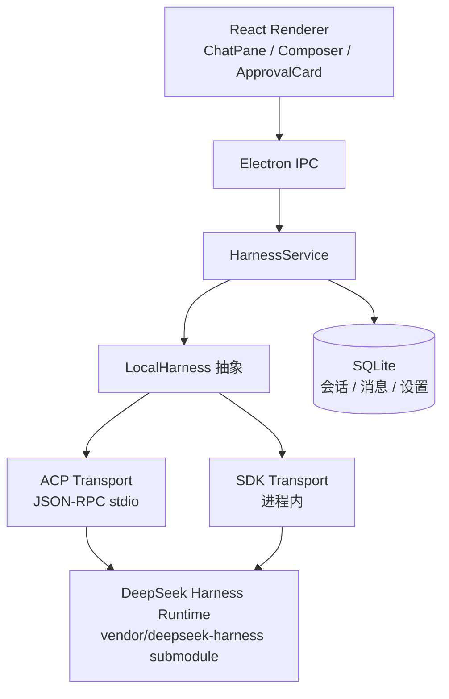

# robbot

> 把 DeepSeek Harness 打包成可用的桌面 Agent 客户端：一个可以扩展技能的本地 Agent 工作台。

[](https://github.com/huiruo/robbot/actions/workflows/ci.yml)

Robbot 是一个 **Electron + React 桌面应用**，核心思路是：**不重复造 agent 运行时，而是封装并驾驭它**。

- 通过 `LocalHarness` 抽象接口屏蔽运行时差异
- 内置双传输通道：**ACP**（JSON-RPC stdio）与 **SDK**（进程内调用），统一映射到同一套事件流
- 以 **skill** 为单位扩展能力（现有 `skill-coding`），后续可加写作、选题、公众号运营等技能
- 本地 SQLite 持久化会话，带审批流（文件编辑 / shell 命令授权）

## 特性

- 💬 流式聊天：用户 / assistant / 运行中状态，事件实时上屏
- 🛠 工具审批：文件编辑、命令执行前可人工确认（Approval 卡片）
- 🔌 双传输：ACP stdio 与 SDK 进程内两种运行模式，能力探测自动降级
- 🧠 会话持久化：SQLite 存储，会话可复用、可中断、可恢复
- 🧩 Skill 架构：新增一个技能 = 实现一个 `execute()`，复用同一 harness 事件流

## 架构



关键设计：

- **`@robbot/core`**：与运行时无关的 harness 契约 —— `LocalHarness`、会话、事件流、审批、中断。
- **`@robbot/dsh-adapter`**：DSH 适配层。SDK 与 ACP 两种 transport 共享同一套事件映射，`runtime manager` 负责解析配置（`config/dsh-runtime.json`）并拉起 / 停止 DSH runtime。
- **`@robbot/skill-*`**：技能包。`skill-coding` 是最小示例：把 harness run 包装成技能接口，后续技能沿用同一模式。
- **`vendor/deepseek-harness`**：Git submodule，即开发期实际运行的 DSH runtime。Robbot 不复制、不 fork，只 vendored 同步。

## 快速开始

前置要求：Node.js ≥ 22（含 corepack）、pnpm。

```bash
# 1. 拉取 submodule（首次）
git submodule update --init --recursive

# 2. 安装依赖
pnpm install

# 3. 构建并启动 DSH runtime（首次较慢）
pnpm dsh:setup

# 4. 启动桌面应用
pnpm dev
```

> 需要真实模型调用时，设置 `DEEPSEEK_API_KEY` 环境变量（或用 `.env` 文件）。没有 key 时应用仍可启动，仅模型生成部分不可用。

## 常用命令

| 命令 | 说明 |
|---|---|
| `pnpm dev` | 启动桌面应用（renderer + electron 热重载） |
| `pnpm build` | 构建全部 workspace 包 |
| `pnpm test:dsh` | 运行 DSH 契约测试（协议层 + 运行时层） |
| `pnpm dsh:setup` | 安装并构建 vendored DSH runtime |
| `pnpm dsh:update` | 同步 DSH submodule 到最新 |
| `pnpm dsh:info` | 查看当前 runtime 信息（commit / 协议 / 模型） |

## 测试

`tests/dsh-contract` 是契约测试，直接针对真实 DSH runtime 验证集成正确性：

- **协议层**：会话创建、流式输出、中断、审批
- **运行时层**：bash 执行、文件编辑、会话持久化

```bash
pnpm test:dsh
```

> 流式测试需要 `DEEPSEEK_API_KEY`；无 key 时自动跳过，其余测试不受影响。

## 项目结构

```text
robbot/
├── apps/
│   └── desktop/            # Electron 桌面应用
│       ├── electron/       # 主进程：IPC、harness 服务、SQLite 存储
│       └── renderer/       # React + Vite UI
├── packages/
│   ├── core/               # LocalHarness 抽象与事件契约
│   ├── dsh-adapter/        # DSH 适配：ACP / SDK 双传输
│   └── skill-coding/       # 第一个技能：coding
├── tests/
│   └── dsh-contract/       # 契约测试
├── scripts/                # dsh:setup / build / update / info
├── config/                 # dsh-runtime.json 等运行配置
└── vendor/
    └── deepseek-harness/   # DSH runtime（git submodule）
```

## 路线图

- [x] Electron 骨架 + React UI
- [x] DSH 双传输（ACP / SDK）与事件映射
- [x] 流式聊天、审批流、SQLite 会话持久化
- [ ] 热榜选题技能（百度 / B 站热榜 → LLM 选题分析）
- [ ] 文章生成技能（选题 → 长文 → 工作区输出）
- [ ] 公众号半自动发布（内容生成 + 排版模板）
- [ ] CI 完整化：e2e、覆盖率、release 构建

## License

Private project. All rights reserved.
